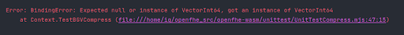

# Tests for OpenFHE-WASM

## Note:

Why did we split out our parameter and cryptocontext generation in the `common.mjs`? Well, if we don't, we run into the following error:

The following links are probably relevant
- [Binding Error: Expected null or instance of [Type X], got an instance of [Type X]](https://github.com/flutter/flutter/issues/75964)
- [Uncaught BindingError: Expected null or instance of Typeface, got an instance of Typeface](https://stackoverflow.com/questions/74490575/uncaught-bindingerror-expected-null-or-instance-of-typeface-got-an-instance-of)